# GO!gym

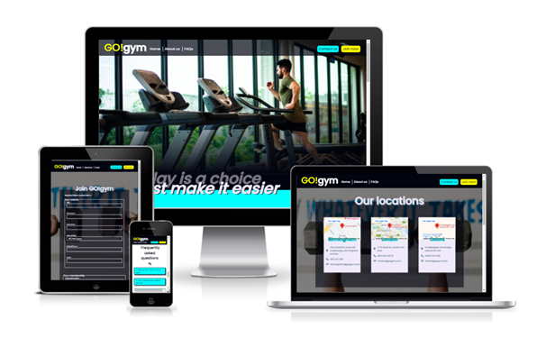

- GO!gym is a gym with the purpose of motivating it’s members to attend regularly by combining as many desirable gym features in one friendly and accessible place. With this motivation, gym-goers will be more likely to keep on track and achieve their fitness goals, whatever they may be.

- Their site exists to provide relevant information to anyone who is considering switching to GO!gym or would like some further information about what they have to offer. It has been built using HTML and CSS and can be viewed on a range of devices, including those with screen-widths as low as 310 pixels, so that users are able to research GO!gym whilst on-the-go.

## Links

[Link to the live project (right click to open in new tab)](https://beckyskel.github.io/html-css-project-1/)

[Link to the project repository (right click to open in new tab)](https://github.com/BeckySkel/html-css-project-1)

---
## Table of Contents
- [Strategy](https://github.com/BeckySkel/html-css-project-1/blob/main/README.md#strategy-1)
    - [Target Audience](https://github.com/BeckySkel/html-css-project-1/blob/main/README.md#target-audience)
    - [User Stories](https://github.com/BeckySkel/html-css-project-1/blob/main/README.md#user-stories)
- [Scope](https://github.com/BeckySkel/html-css-project-1/blob/main/README.md#scope-1)
    - [Research](https://github.com/BeckySkel/html-css-project-1/blob/main/README.md#research)
    - [Future Features](https://github.com/BeckySkel/html-css-project-1/blob/main/README.md#future-features)
    - [Testing](https://github.com/BeckySkel/html-css-project-1/blob/main/README.md#testing)
- [Structure](https://github.com/BeckySkel/html-css-project-1/blob/main/README.md#structure-1)
    - [Wireframes](https://github.com/BeckySkel/html-css-project-1/blob/main/README.md#wireframes)
    - [Information Architecture](https://github.com/BeckySkel/html-css-project-1/blob/main/README.md#information-architecture)
- [Skeleton](https://github.com/BeckySkel/html-css-project-1/blob/main/README.md#skeleton-1)
    - [Current Features](https://github.com/BeckySkel/html-css-project-1/blob/main/README.md#current-features)
    - [Technologies Used](https://github.com/BeckySkel/html-css-project-1/blob/main/README.md#technologies-used)
- [Surface](https://github.com/BeckySkel/html-css-project-1/blob/main/README.md#surface-1)
    - [Design](https://github.com/BeckySkel/html-css-project-1/blob/main/README.md#design)
    - [Deployment](https://github.com/BeckySkel/html-css-project-1/blob/main/README.md#deployment)
- [Credits](https://github.com/BeckySkel/html-css-project-1/blob/main/README.md#credits)
    - [Content](https://github.com/BeckySkel/html-css-project-1/blob/main/README.md#content)
    - [Media](https://github.com/BeckySkel/html-css-project-1/blob/main/README.md#media)
    - [Acknowledgemnets](https://github.com/BeckySkel/html-css-project-1/blob/main/README.md#acknowledgements)

---
## Strategy

### Target Audience
- The website is targeted towards active individuals around the UK cities of Birmingham, Oxford or London who either aren't satisfied with their current gym and are looking for a more affordable or convenient option, or those who are looking to join a gym for the first time and may need extra support to keep on track. 

### User Stories

#### Potential members – Regular gym-goers, looking to switch
*These are users who already have/have previously had a membership to another gym but are considering switching*
- As a regular gym-goer, I would like to know what features sets this gym apart from my current one.
- As a regular gym-goer, I would like to know the opening hours and available locations so that I can plan my routine.
- As a regular gym-goer, I would like to know the cost(s) of a membership.

#### Potential members – New gym-goers
*These are users who have potentially never had a gym-membership but are interested in signing-up for one*
- As a new gym-goer, I would like to view existing member’s experiences, including frequently asked questions and member reviews.
- As a new gym-goer, I hope to see information about the sign-up process and what to expect.
- As a new gym-goer, I would like the ability to contact the company to enquire about any information that I have not been able to find on the website.
- As a new gym-goer I hope to find a clear and easy way to sign up, should I choose to attend.

#### Current members
*These are users who are already members of GO!gym*
- As a current member, I would like to see the contact information of my local gym, should I need to contact them.
- As a current member, I may need to view information on altering or cancelling my membership.
- As a current member, I would like to see a timetable of the available classes.
- As a current member, I would like links to the social medias of the gym so that I can follow them and tag them in my posts.

---
## Scope

### Research
- Before any planning, I conducted research into other gym websites and took note of common features and layouts, as well as which features I thought were affective and would be good to include for GO!gym and my target audience.

### Future Features

#### Classes
- There could be a link to a classes calendar or booking page so that users can get themselves booked onto a class. Because this is a members-only gym, these features would most likely need to be hidden behind a member log in function and since this project is a static frontend site which focuses on using only HTML and CSS, this would not be possible to implement at this stage.

#### Member login
- A member login area would be a good way to invite existing members back to the site more often. As previously mentioned, this would not be possible using only HTML and CSS and without the use of other languages.

#### Payment
- To make the sign-up form functional, there would usually be a payment section included within the form itself. Or, after submitting the sign-up form, the user would be lead to an external payment page such as PayPal. There is no payment account connected to GO!gym and this would only be for effect. At this stage, there would also be no way to bring the user back to the site without having made payment, so they would not receive the thank you message with further instructions.

### Testing
- Throughout the project, I relied heavily on [Chrome Devtools](https://developer.chrome.com/docs/devtools/) to help me view this project on different screen sizes so that I could adjust elements and create media queries for different devices. 
- Please follow [this link](assets/documents/TESTING.md) for full list of tests carried out on this website

---
## Structure

### Wireframes
- After looking at common themes and deciding what I would like to include, I mapped out the intended features of the website using [Balsamiq]() to create wireframes of each page
- [View the wireframes here](assets/documents/wireframes.pdf)

### Information architecture
- GO!gym is a landing site for a collection of gyms in 3 different cities across the UK. The website has a home page with key information about the membership-perks and gym sites themselves.
- The information is presented in a catchy, easy-to-digest way, with the information presented in a mix of informative paragraphs, graphic key-points and interactive elements. There is also a mix of official GO!gym-written material and user-submitted content.  (i.e. frequently asked questions (FAQs) and member reviews).
- The home page has been split in to 3 main sections (6 defined sections in total, but grouped by similarity for the sake of cleaner navigation) links to these can be found in the main navigation, alongside links to the other pages of the website; Contact page and Sign Up page.
- All forms on this site are currently dummy forms for presentation purposes only, the information does not get stored anywhere but each form displays a different thank you message on submission to feedback to the user that their submission was successful.

---
## Skeleton

### Current Features

#### Header/navigation
- The main navigation bar features a soft black background with a large logo to the far-left that links back to the homepage, 3 divider-separated links in white alongside it, and 2 bold button-style links to the far-right. The different formatting and separation of the navigation links is due to the different roles they play: the left links link to different sections on the main homepage and the right-hand links lead to different pages of the website.
- The header is sticky and consistent across all pages and screen sizes so the user can always easily return to all pages/sections.
- On the homepage, the header is transparent when over the hero image to provide a better view of the contents but opaque after scrolling as to reduce distractions and noise when scrolling. 
- I have used CSS to provide visual aid when hovering over each link but added no styling for the ‘active’ page as this may cause confusion when using the homepage links as you can scroll from one section to the next without the use of the links. The supporting pages are also a lot smaller with large headings so ‘active’ styling is unnecessary.

#### Hero image
- The hero image takes up the majority of the viewport and shows a man running on a treadmill.
- The bottom of the image fades into a black div to harmonise with the transparent header and transition into the first section. There is a large slogan that spreads across the bottom of the hero image and onto the first section, taking up the rest of the screen-space and further aiding the transition. The overlapping, shadowed text of this slogan is carried throughout the site on headers.
- The image size and placement changes slightly based on the screen size so the subject is vertically-centred and can always been seen.
- The large image will capture the users attention and immediately conveys the use of the website.

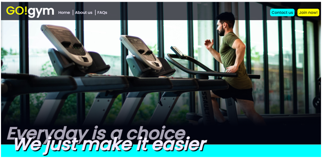

#### Key points
- The key selling points are presented on 3 large cards in a line with single sentences and a large icon, relevant to the information.
- These cards provide the user a good starting-point of the most desirable features that the gym has to offer, without having to scroll too far or read too much.

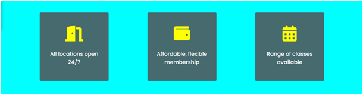

#### About us
- The about us section consists of a large heading, an image and 3 paragraphs of the gym’s key principles and selling-points. There is also a large ‘Join now!’ link which leads to the sign-up page; the styling of this link is consistent with the same link in the navigation bar.
- The intention is to provide the user with some useful information about the gym and their membership plans.
- There are 2 links within the text of the paragraphs which lead to the locations section of the contact page and the sign-up page respectively. The text within the link is relevant to the destination but aria labels have been added to avoid ambiguity and let the visually impaired know where the link will take them. These links will be highlighted with a yellow background when hovered over.
- As the screen size shrinks, the image will display on top of the text to provide more room.

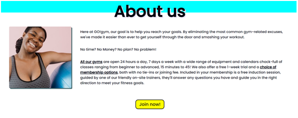

#### Gym features
- The features section is split into 3 captions and their associated images.
- The caption is a short, single-sentence block of text with a heading. The images relate to what is said in the captions.
- As the viewport shrinks, the captions and images stack on top of each other to fit the screen.
- These images and captions provide the user with a peek into the gym and lets them know what to expect should they choose to join.

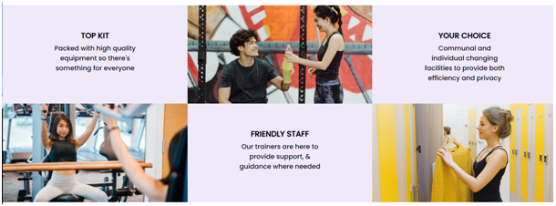

#### FAQs
- To save space, the FAQs have been placed in details elements which extend when clicked. This was a standard which I noticed when completing research towards this project.
- The summary of the element is the question, this is always visible, and the response is hidden until the element is clicked. 
- Styling has been applied when hovering over the summary and when the element is active in order to tell the user that this element can be interacted with and to provide clear definition between the questions and answers when open.
- The user can interact with these elements to show the answer to any questions they may be interested in.
- There are 2 internal links within the answer paragraphs which lead to the contact and sign up pages. The text within the links is relevant to the destination but aria labels have been added to aid the visually impaired. The links are highlighted yellow when hovered over.

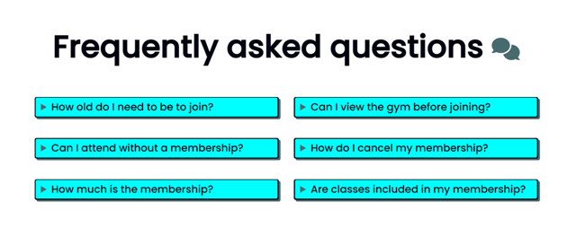
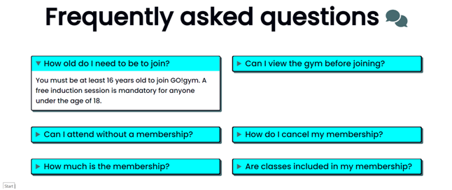

#### Reviews
- 3 user reviews have been placed in a container that the user can use links to interact with in order to scroll along, left or right. This is replaced on smaller screens with a plain scrolling section to avoid crowding the screen.
- Each review has a heading with the reviewers name and a paragraph block with their review.
- Users will be able to see what others have thought about the gym and it's features before they sign up.
- A border with 2 quote icons is placed over the review window and buttons with left and right chevrons are placed on either side. These control the direction of the scroll. A transition of 0.5 seconds has been applied so that there is a smooth scroll between the reviews.
- The yellow background is bright and eye-catching and the subtle shadows give the illusion that the review and buttons are floating over the background.

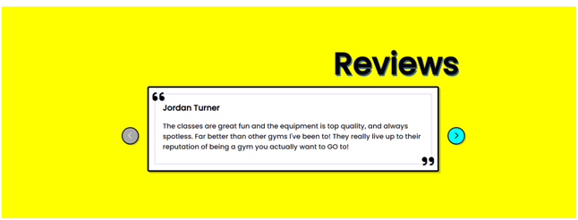

#### Footer
- All pages require some scrolling on most screen sizes and therefore a ‘back to top’ button has been provided. The button features an up arrow icon for illustration of the outcome. As the screen shrinks, the text is removed and the icon remains so the outcome is clear without visually crowding the footer.  
- Non sticky so that the user can see more of the site while scrolling through.
- External links to social medias, opening in a separate tab. Aria labels provided for visually impaired.
- The footer mirrors the layout of the header bar for visual balance.

#### Locations
- The contact page features 2 sections. The first is the current locations of the gyms, along with their addresses and contact information so that the user can contact their gym directly if they need to.
- The info is presented in floating cards with a google map iframe, a heading with the city name, and a table to present the contact info in an organised way. Clicking a link on the iframe opens a full-size google map in a new tab. 
- Icons are placed to the left of the contact info to act as bullet points and clues to the instruction of the following information.
- The 3 cards change shape and configuration on smaller screen sizes until stacked on top of each other.

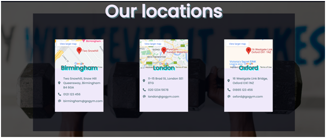

#### Contact
- The contact section is a query submission form for users who would like to contact the company in general instead of a specific location. It will validate that the required fields have been filled in before allowing the user to submit.
- On submission, the page will refresh and a pop-up thank you message will display letting the user know that their message has been sent and we will be in contact. Dummy form, info not actually processed.
- Single line of Javascript used to convey to the user that submission was successful.

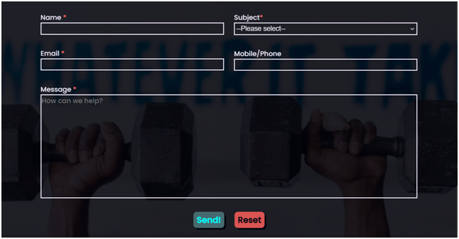

#### Sign-up
- The sign up page consists of a single section with a detailed sign-up for split into 2 fieldsets - "your details and "your membership".
- The user inputs their personal and contact info into the first section and then chooses their desired location and plan in the second. The required fields are validated before submitting and terms and conditions are available as a document that open on a new tab.
- After submitting, the user is directed to a thank you page to show that the submission was successfully sent, lets them know what to expect next and provides a link to the contact page if they have any questions.
- Another dummy form, info not actually processed

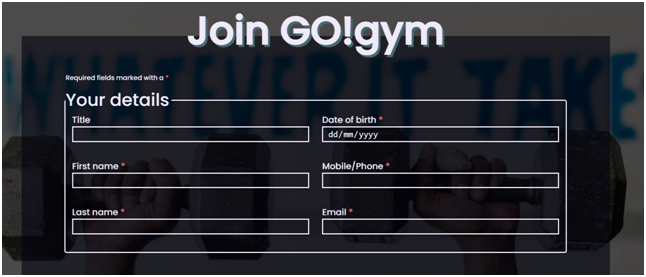
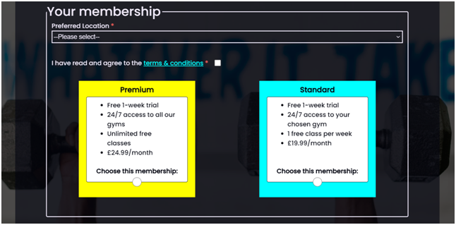
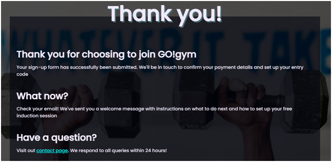

### Technologies used

#### Languages
- [HTML](https://en.wikipedia.org/wiki/HTML)
- [CSS](https://en.wikipedia.org/wiki/CSS)
- [Git](https://en.wikipedia.org/wiki/Git) for version control

#### Other resources
- [Gitpod](https://www.gitpod.io/) to alter and manage website files
- [Github](https://github.com/) to create and store website files
- [Github Pages](https://pages.github.com/) to deploy site
- [Chrome Devtools](https://developer.chrome.com/docs/devtools/) to test site throughout process
- [Balsamiq](https://balsamiq.com/) to create wireframes
- [Coolors](https://coolors.co/) to choose a colour scheme
- [Google Fonts](https://fonts.google.com/) for the website font (Poppins)
- [Font Awesome](https://fontawesome.com/) used to add icons
- [MS Paint](https://apps.microsoft.com/store/detail/paint/9PCFS5B6T72H?hl=en-us&gl=US) used to create the favicon
- [Pexels](https://www.pexels.com/) for images
- [Code Institute](https://codeinstitute.net/) fullstack developer course to learn how to create
- [W3Schools](https://www.w3schools.com/) for help with common coding issues
- [Flexbox Froggy](https://flexboxfroggy.com/) to learn the basics of flexbox design
- [Am I Responsive?](https://ui.dev/amiresponsive) for device simulations

---
## Surface

### Design

#### Colour scheme

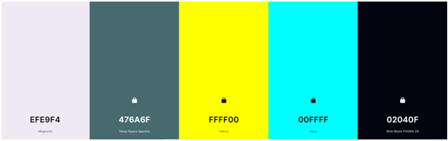

- A bright and energising colour scheme has been used to elicit feelings of excitement and motivation.
- I used [Coolors](https://coolors.co/) to help pick a colour scheme.
- There are 3 base colours and 2 highlights. The base colours are off-white, warm grey and soft black. The highlights are neon yellow and blue. AThis vibrant palette represents the gym values of being enjoyable and unintimidating.

#### Imagery
- All images sourced from [Pexels](https://www.pexels.com/)
- The images were chosen with a similar saturation of colours to that of the website itself. The colour-scheme is vibrant and high contrast, so images were chosen that matched this.
- All images remain relevant to the website with the subjects interacting with either the exercise equipment or other gym features. Most subjects are smiling to further convey the message that this gym is an inviting place.

#### Typography
- All text is in the Poppins font. It is a geometric sans serif typeface that is clear and easily read. It’s playful style pairs well with the bold colours and curved edges used in the design of the site. 
- Sans serif has been used as the fallback option as it is the closest web-safe font.

#### Icons
- [Font Awesome](https://fontawesome.com/) icons were used alongside key information to provide visual aid of the associated information .
- Also used for links and buttons to provide recognisable imagery of the outcome after clicking.

### Deployment
- This site was deployed on Github Pages, following the below steps:
    1. Acces the Github repository [here](https://github.com/BeckySkel/html-css-project-1)
    2. Navigate to the **Settings** tab (far right tab)
    3. Open the **Pages** information
    4. Select branch **main**
    5. Wait for site to deploy (this make take a few minutes) 
- Access the live site [here](https://beckyskel.github.io/html-css-project-1/)

---
## Credits

### Content
- Websites used for initial research:
     - [Buzz Gym](https://www.buzzgym.co.uk/oxford/?gclid=CjwKCAjw9qiTBhBbEiwAp-GE0V2NeDWHa0WffEnFOSEqvzUxT8-vzemoWl1melvAitSriELdtHzGKRoC2m4QAvD_BwE)
     - [24/7 Fitness](https://247fitness.co/)
     - [Results Fitness](https://www.results-fitness.com/)
     - [Pure Gym](https://www.puregym.com/?utm_medium=cpc&gclid=CjwKCAjw9qiTBhBbEiwAp-GE0Wu4_S67LZEQWitYwxpOW9M1WnME0NxkU_VoQpUGReY-IOFc4rgHSRoCi3EQAvD_BwE&gclsrc=aw.ds)
     - [Planet Fitness](https://www.planetfitness.com/)
     - [Anytime Fitness](https://www.anytimefitness.co.uk/gyms/uk-0248/headington-oxford-south-east-ox3-9ax/?gclid=CjwKCAjw9qiTBhBbEiwAp-GE0RnPSCY0PGybwjnrqrJSfBdT4HJTDvMDGKyMTP9dw9ZnDdZXmovAzRoCdd8QAvD_BwE)
     - [The Gym Group](https://www.thegymgroup.com/find-a-gym/oxford-gyms/oxford-headington/?gclid=CjwKCAjw9qiTBhBbEiwAp-GE0TkNKOxib3aQ5R3zSta1WS30X40eqWltln_EsSMRH_HojW1c3d9zYhoCUZkQAvD_BwE&gclsrc=aw.ds)
     - [Better Leisure](https://www.better.org.uk/memberships/gym-membership-deals-and-offers?utm_source=google&utm_medium=paid&utm_campaign=bau&utm_term=better&gclid=CjwKCAjw9qiTBhBbEiwAp-GE0dHDD78e3w0wVUVEFU0C8-EcolRML4_fnci4lanNUSu6KqturOLaTBoCxcEQAvD_BwE&gclsrc=aw.ds) 
     - [Results Health Club](https://resultshealthclubs.co.uk/)
- Issues with flexbox forcing non-active FAQs to open along with active ones, solved with help from [Techstacker](https://techstacker.com/prevent-flexbox-child-element-height-stretch-css/)
- Thank you message after completion of contact form provided by [obayral (user on Stack Overflow)](https://stackoverflow.com/questions/54133144/show-thank-you-message-on-form-submit)
- Code for maps iframes provided by [Google Maps](https://www.google.com/mapshttps://www.google.com/maps) embed feature. Height and width altered by me to fit desired location.
- Social media links inspired by [Code Institute](https://codeinstitute.net/) Love Running project, heavily altered by me.
- Issue with select element and required attribute solved with help from [Jibin and Adhan Timothy Younes (users on Stack Overflow)](https://stackoverflow.com/questions/44322824/select-required-not-working)
- Code for non-sticky footer which is always at bottom of page, even with small amount of content by [CSS Tricks](https://css-tricks.com/couple-takes-sticky-footer/)

### Media
- All icons form [Font Awesome](https://fontawesome.com/)
- All images from [Pexels](https://www.pexels.com/)
- All Hex to RGBA conversions achieved with [Hex Color Tool](https://www.hexcolortool.com/)

### Acknowledgements
- [Code Institute](https://codeinstitute.net/) for providing excellent learning content 
- Reuben Ferrante as my mentor
- [W3Schools](https://www.w3schools.com/) for quick and easy guidance on HTML and CSS
- The users of [Stack Overflow](https://stackoverflow.com/) for asking and answering some of the harder HTML and CSS questions
- Other CI students for sharing their work and providing inspiration and guidance on mine

---
Please note that GO!gym is a ficticious gym invented for demonstration purposes and this website was built as a submission for my portfolio project 1 on the Code Institute Fullstack Developer course.

Becky Skelcher 2022

