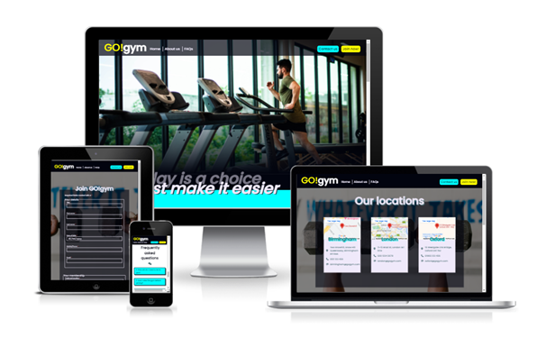

#GO!gym

GO!gym is a gym with the purpose of motivating it’s members to attend regularly by combining as many desirable gym features in one friendly and accessible place. With this motivation, gym-goers will be more likely to keep on track and achieve their fitness goals, whatever they may be.

The website is targeted towards active individuals around the UK cities of Birmingham, Oxford or London who either aren't satisfied with their current gym and are looking for a more affordable or convenient option, or those who are looking to join a gym for the first time and may need extra support to keep on track.

Their site exists to provide relevant information to anyone who is considering switching to GO!gym or would like some further information about what they have to offer. It has been built using HTML and CSS and can be viewed on a range of devices, including those with screen-widths as low as 310 pixels, so that users are able to research GO!gym whilst on-the-go.

###Links

[Link to the live project](https://beckyskel.github.io/html-css-project-1/)
[Link to the project repository](https://github.com/BeckySkel/html-css-project-1)

##Table of Contents
- [Strategy](##Strategy)
    - 
    - 
    - 
- [Scope](##Scope)
    - 
- [Structure](##Structure)
    -
- [Skeleton](##Skeleton)
- [Surface](##Surface)

##Strategy

###Research

###User Stories
###Potential members – Regular gym-goers, looking to switch
*These are users who already have/have previously had a membership to another gym but are considering switching*
- As a regular gym-goer, I would like to know what features sets this gym apart from my current one.
- As a regular gym-goer, I would like to know the opening hours and available locations so that I can plan my routine.
- As a regular gym-goer, I would like to know the cost(s) of a membership.

###Potential members – New gym-goers
*These are users who have potentially never had a gym-membership but are interested in signing-up for one*
- As a new gym-goer, I would like to view existing member’s experiences, including frequently asked questions and member reviews.
- As a new gym-goer, I hope to see information about the sign-up process and what to expect.
- As a new gym-goer, I would like the ability to contact the company to enquire about any information that I have not been able to find on the website.
- As a new gym-goer I hope to find a clear and easy way to sign up, should I choose to attend.

###Current members
*These are users who are already members of GO!gym*
- As a current member, I would like to see the contact information of my local gym, should I need to contact them.
- As a current member, I may need to view information on altering or cancelling my membership.
- As a current member, I would like to see a timetable of the available classes.
- As a current member, I would like links to the social medias of the gym so that I can follow them and tag them in my posts.

#Wireframes
- To map out the intended features of the website, I used Balsamiq to create wireframes of each page
- [View the wireframes here](assets/documents/WIREFRAMES.pdf)

##Scope

##Structure

##Skeleton

##Surface

