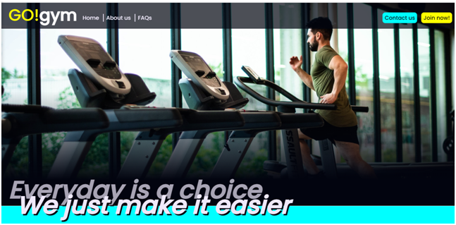

# GO!gym

GO!gym is a gym with the purpose of motivating it’s members to attend regularly by combining as many desirable gym features in one friendly and accessible place. With this motivation, gym-goers will be more likely to keep on track and achieve their fitness goals, whatever they may be.

The website is targeted towards active individuals around the UK cities of Birmingham, Oxford or London who either aren't satisfied with their current gym and are looking for a more affordable or convenient option, or those who are looking to join a gym for the first time and may need extra support to keep on track.

Their site exists to provide relevant information to anyone who is considering switching to GO!gym or would like some further information about what they have to offer. It has been built using HTML and CSS and can be viewed on a range of devices, including those with screen-widths as low as 310 pixels, so that users are able to research GO!gym whilst on-the-go.

## Links

[Link to the live project](https://beckyskel.github.io/html-css-project-1/)

[Link to the project repository](https://github.com/BeckySkel/html-css-project-1)

---
## Table of Contents
- [Strategy](##Strategy)
    - 
    - 
    - 
- [Scope](##Scope)
    - 
- [Structure](##Structure)
    - 
- [Skeleton](##Skeleton)
    - 
- [Surface](##Surface)
    - 

---
## Strategy

### Research

### User Stories

#### Potential members – Regular gym-goers, looking to switch
*These are users who already have/have previously had a membership to another gym but are considering switching*
- As a regular gym-goer, I would like to know what features sets this gym apart from my current one.
- As a regular gym-goer, I would like to know the opening hours and available locations so that I can plan my routine.
- As a regular gym-goer, I would like to know the cost(s) of a membership.

#### Potential members – New gym-goers
*These are users who have potentially never had a gym-membership but are interested in signing-up for one*
- As a new gym-goer, I would like to view existing member’s experiences, including frequently asked questions and member reviews.
- As a new gym-goer, I hope to see information about the sign-up process and what to expect.
- As a new gym-goer, I would like the ability to contact the company to enquire about any information that I have not been able to find on the website.
- As a new gym-goer I hope to find a clear and easy way to sign up, should I choose to attend.

#### Current members
*These are users who are already members of GO!gym*
- As a current member, I would like to see the contact information of my local gym, should I need to contact them.
- As a current member, I may need to view information on altering or cancelling my membership.
- As a current member, I would like to see a timetable of the available classes.
- As a current member, I would like links to the social medias of the gym so that I can follow them and tag them in my posts.

### Wireframes
- To map out the intended features of the website, I used Balsamiq to create wireframes of each page
- [View the wireframes here](assets/documents/wireframes.pdf)

---

## Scope

### Future Features

---
## Structure

### Outline
- GO!gym is a landing site for a collection of gyms in 3 different cities across the UK. The website has a home page with key information about the membership-perks and gym sites themselves.
- The information is presented in a catchy, easy-to-digest way, with the information presented in a mix of informative paragraphs, graphic key-points and interactive elements. There is also a mix of official GO!gym-written material and user-submitted content.  (i.e. frequently asked questions [FAQs] and member reviews).
- The home page has been split in to 3 main sections (6 defined sections in total, but grouped by similarity for the sake of cleaner navigation) links to these can be found in the main navigation, alongside links to the other pages of the website; Contact page and Sign Up page.
- All forms on this site are currently dummy forms for presentation purposes only, the information does not get stored anywhere but each form displays a different thank you message on submission to feedback to the user that their submission was successful.

### Current Features

#### Header/navigation
- The main navigation bar features a soft black background with a large logo to the far-left that links back to the homepage, 3 divider-separated links in white alongside it, and 2 bold button-style links to the far-right. The different formatting and separation of the navigation links is due to the different roles they play: the left links link to different sections on the main homepage and the right-hand links lead to different pages of the website.
- The header is sticky and consistent across all pages and screen sizes so the user can always easily return to all pages/sections.
- On the homepage, the header is transparent when over the hero image to provide a better view of the contents but opaque after scrolling as to reduce distractions and noise when scrolling. 
- I have used CSS to provide visual aid when hovering over each link but added no styling for the ‘active’ page as this may cause confusion when using the homepage links as you can scroll from one section to the next without the use of the links. The supporting pages are also a lot smaller with large headings so ‘active’ styling is unnecessary.

#### Hero image
- The hero image takes up the majority of the viewport and shows a man running on a treadmill.
- The bottom of the image fades into a black div to harmonise with the transparent header and transition into the first section. There is a large slogan that spreads across the bottom of the hero image and onto the first section, taking up the rest of the screen-space and further aiding the transition. The overlapping, shadowed text of this slogan is carried throughout the site on headers.
- The image size and placement changes slightly based on the screen size so the subject is vertically-centred and can always been seen.

#### Key points

#### About us

#### Gym features

#### FAQs

#### Reviews

#### Footer

#### Locations

#### Contact

#### Sign-up

---
## Skeleton

---
## Surface

---

